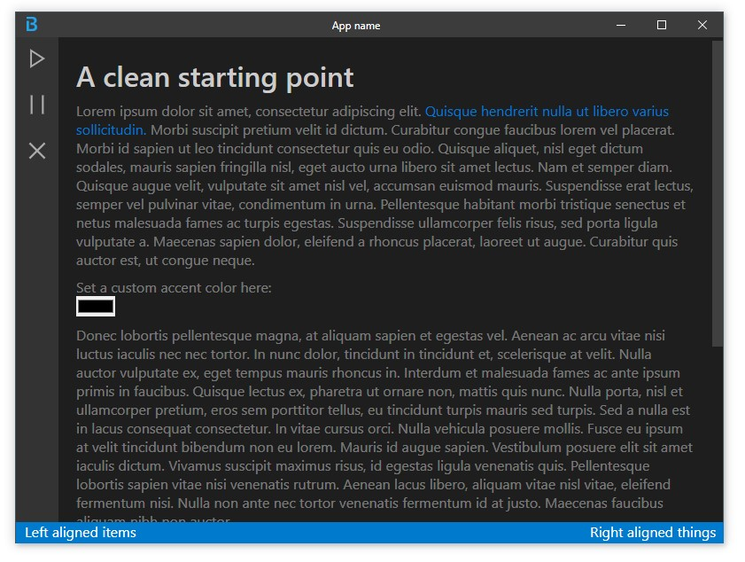

# electron-vscode-boilerplate
Start building your electron app already looking great




## Goal
- A simple reliable boilerplate that removes hassle of starting from scratch building in electron.  
- Easily customizable with css color variables
- Match VS codes modern clean look 
- Work well on both windows and mac


## How to build
Replace `my-app` with your own name.
```console
git clone https://github.com/Jesper-Hustad/electron-vscode-boilerplate.git my-app
cd ./my-app
npm install
npm start
```


## Issues
- [ ] Haven't tested mac, need to make sure it looks good on there
- [ ] Clean up code, refactoring required
- [ ] Show more functionality of boilerplate.  
  - buttons  
  - [x] accent color variable
  - more?

- [ ] Add titlebar items like file, edit, etc... (not 100% necessary)

## Notes
Open to feedback and PR
